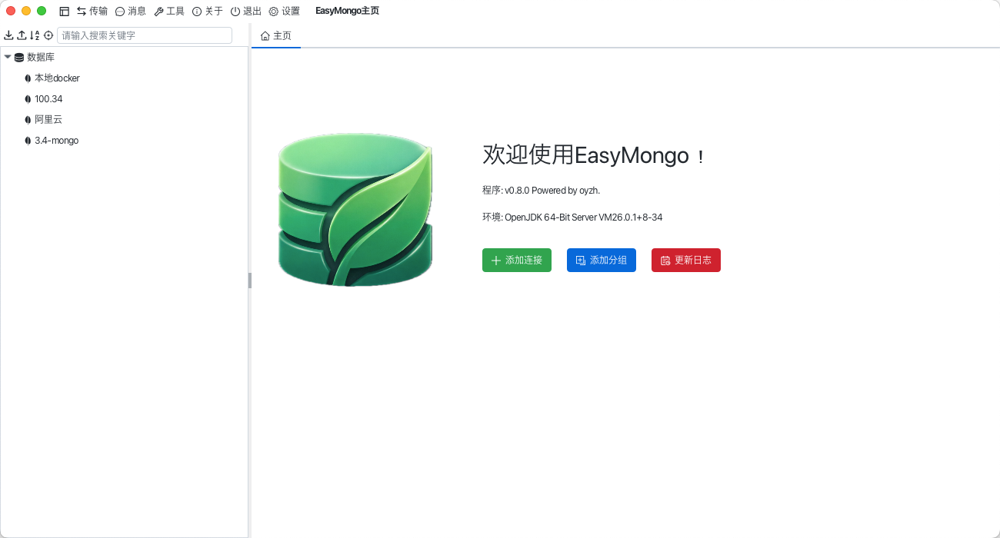
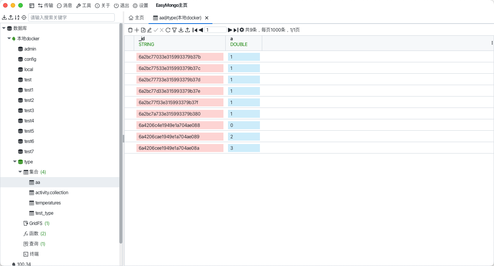
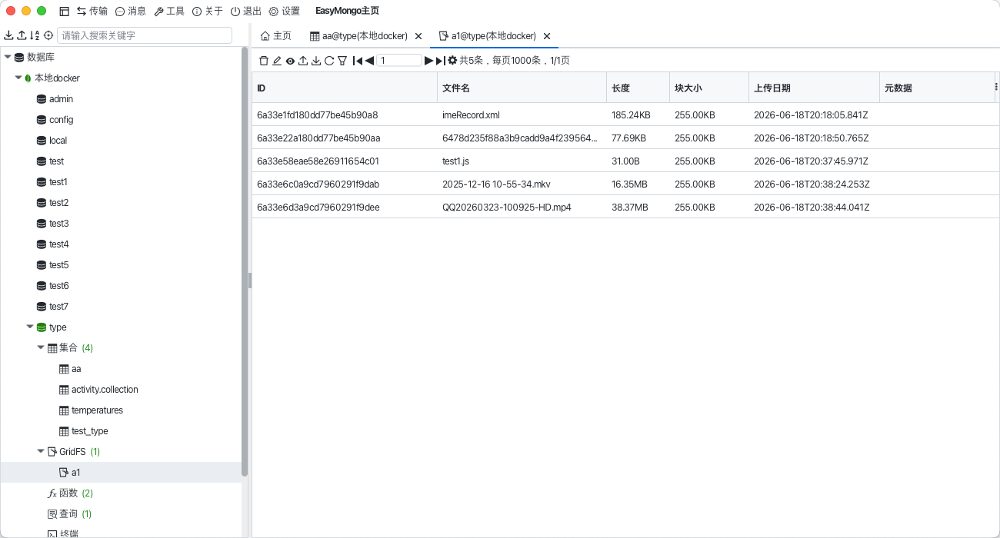
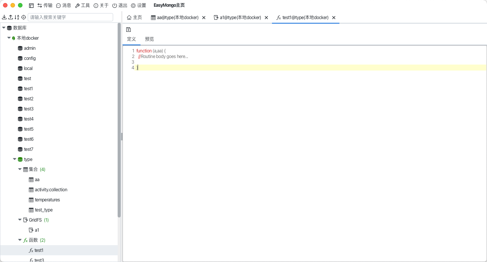
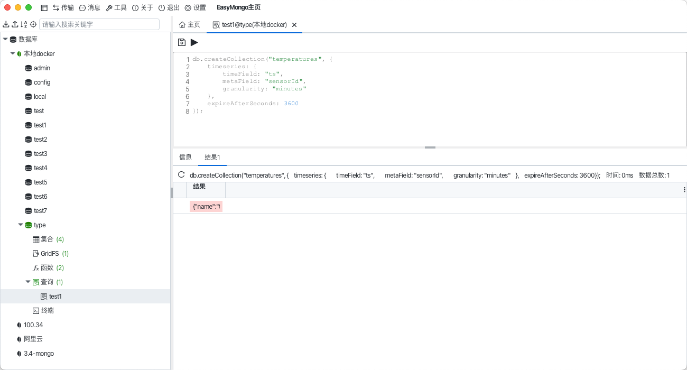
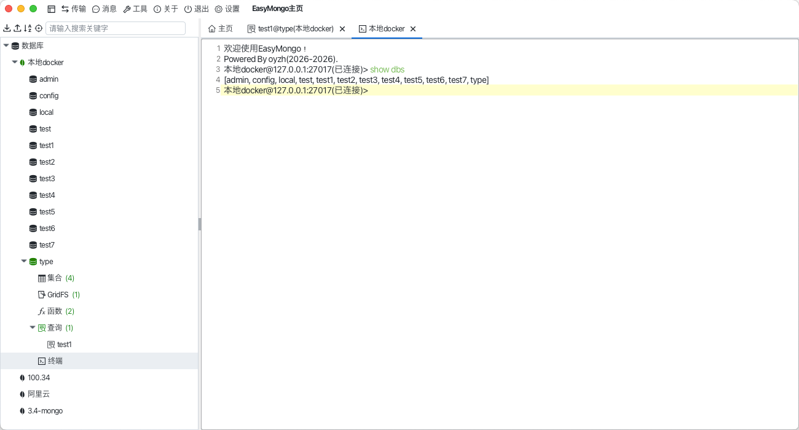
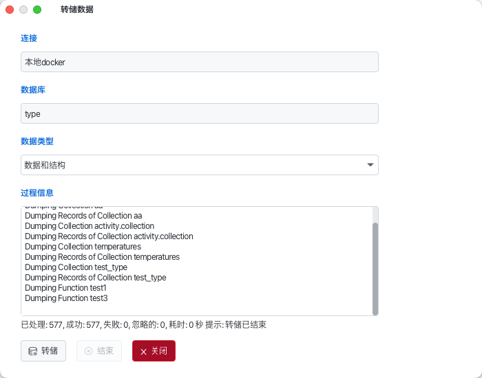
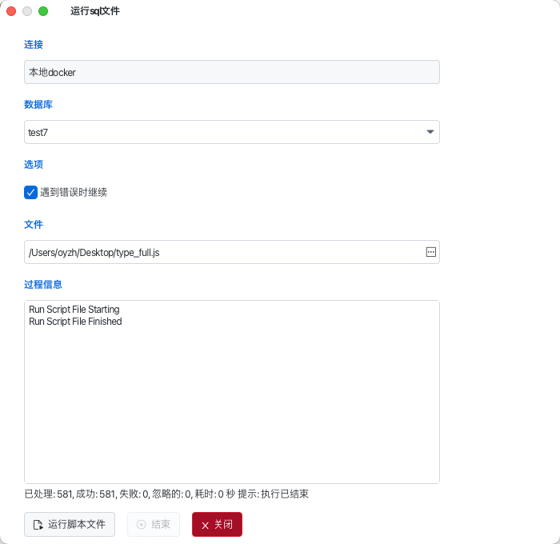
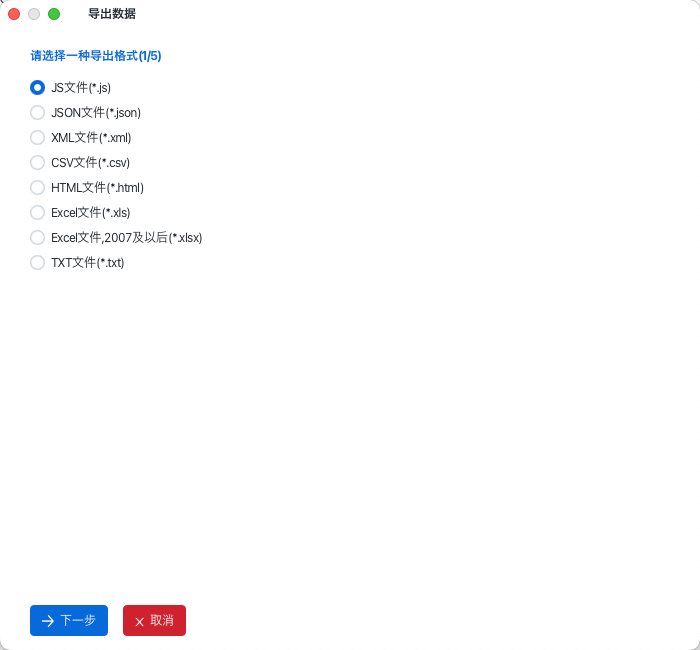
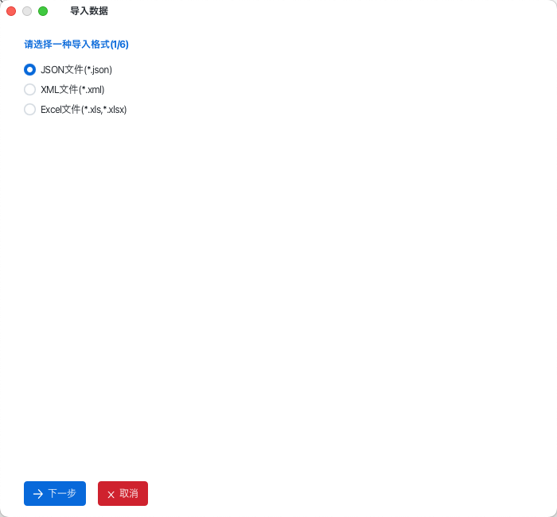

# 项目
###### 项目说明
这是一个使用javafx编写的mongodb客户端，支持基本的连接管理，分组管理、数据操作、操作命令查看、表、存储桶、函数、用户管理、导入导出、数据传输、查询等功能，还支持暗色主题、系统主题跟随等能力。  
后续更新移步已至  
https://gitee.com/oyzh1994/easyshell

###### 启动入口
cn.oyzh.easymongo.EasyMongoBootstrap 
注意，如果要运行项目，最好切换到最新分支，不然可能启动不了，主分支master代码是定期合并进去  
ide建议idea社区版或者专业版

###### 依赖说明
1. base工程
 https://gitee.com/oyzh1994/base  
2. fx-base工程
 https://gitee.com/oyzh1994/fx-base  
3. jdk版本要求25  
注意，如果是linux的arm平台，建议使用aws的jdk，其他jdk可能缺失hsdis类库，其他情况下优先使用openjdk  
awsjdk25 https://docs.aws.amazon.com/corretto/latest/corretto-25-ug/downloads-list.html  
openjdk https://jdk.java.net/archive/

###### 结构说明 
docker -> docker配置文件  
docs -> 文档相关资源  
package -> 打包相关配置  
resource -> 项目相关资源文件  
src -> 项目相关代码

# Maven
###### 打包
mvn -X clean package -DskipTests

# 程序相关截图
###### 截图1

###### 截图2

###### 截图3

###### 截图4

###### 截图5

###### 截图6

###### 截图7

###### 截图8

###### 截图9

###### 截图10

